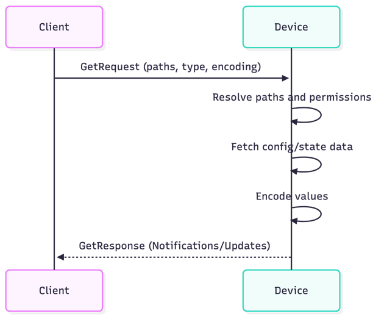

# IBN gNMI Project
As part of the Intent Based Networking Class of Autumn 25, this repository outlines the steps and code run to get the gNMI lab running on containerlab going. This lab was part of a group project / presentation which contributed to the final grade of this module. This repository will guide you through how to get the lab setup and how to get a better understanding for the ins and outs of gNMI including its configuration. This lab mainly works with the implementation of gNMIc.

## Getting Started
To run this lab a few prerequisits must be met by the host.

### Prerequisits
1. Docker must be installed: https://docs.docker.com/engine/install/
2. Containerlab must be installed: https://containerlab.dev/install/
3. The SRL Telemetry Lab has to be cloned to your machine: https://github.com/srl-labs/srl-telemetry-lab/
4. gNMIc installed on your host

Once all prerequisits are met the LAB can be spun up by running `sudo containerlab deploy` in the directory holding the file https://github.com/srl-labs/srl-telemetry-lab/blob/main/st.clab.yml.
</br>
Verification of the succesfull deployment:
```sh
docker ps
# CONTAINER ID   IMAGE                                       COMMAND                  CREATED        STATUS        PORTS                                          NAMES
# be916b6a7563   ghcr.io/srl-labs/network-multitool:v0.2.1   "/bin/sh /docker/ent…"   25 hours ago   Up 25 hours   22/tcp, 80/tcp, 443/tcp, 1180/tcp, 11443/tcp   server03
# 7e0ec3e768d2   ghcr.io/nokia/srlinux:24.10.3               "/tini -- fixuid -q …"   25 hours ago   Up 25 hours                                                  spine02
# deab2f37ca0b   ghcr.io/srl-labs/network-multitool:v0.2.1   "/bin/sh /docker/ent…"   25 hours ago   Up 25 hours   22/tcp, 80/tcp, 443/tcp, 1180/tcp, 11443/tcp   server02
# acbb235b9864   ghcr.io/srl-labs/network-multitool:v0.2.1   "/bin/sh /docker/ent…"   25 hours ago   Up 25 hours   22/tcp, 80/tcp, 443/tcp, 1180/tcp, 11443/tcp   server01
# f34c2d934666   grafana/grafana:11.5.2                      "/run.sh"                25 hours ago   Up 25 hours   0.0.0.0:3000->3000/tcp, [::]:3000->3000/tcp    grafana
# 44541b3a8b8c   quay.io/prometheus/prometheus:v3.2.1        "/bin/prometheus --c…"   25 hours ago   Up 25 hours   0.0.0.0:9090->9090/tcp, [::]:9090->9090/tcp    prometheus
# fb4ef9ce9f74   ghcr.io/nokia/srlinux:24.10.3               "/tini -- fixuid -q …"   25 hours ago   Up 25 hours                                                  leaf02
# 80e5e41c517a   ghcr.io/nokia/srlinux:24.10.3               "/tini -- fixuid -q …"   25 hours ago   Up 25 hours                                                  spine01
# b3c05a391694   ghcr.io/nokia/srlinux:24.10.3               "/tini -- fixuid -q …"   25 hours ago   Up 25 hours                                                  leaf03
# 763bc18b225e   ghcr.io/nokia/srlinux:24.10.3               "/tini -- fixuid -q …"   25 hours ago   Up 25 hours                                                  leaf01
```
Once verified proceed with applying the configuration stored in `gnmi-config.yaml` by running `gnmic --config ./gnmi-config.yaml subscribe` on the host. You can verify this by going the hosts IP `ip -c a` and going to port 3000. You should be able to open a Grafan Dashboard that now should be ingesting information properly.

## Request Model and Remote Procedure Calls
In this lab we work with gNMIc implementation of the gNMI protocol. Most if not all commands used in this lab are also interchangeable with the gNMI_CLI cli tool written in go. Further information on the installation can be found here: [docs](https://github.com/openconfig/gnmi)

### gNMI Encoding
The encoding for gNMI is outlined in the RFC-7951 on JSON Encoding of Data Modeled with YANG. [RFC-7951](https://datatracker.ietf.org/doc/html/rfc7951). This RFC defines the Tree and Leaf structure used to model data in json format and how to map this json format to the paths used in the YANG model.

### Get RPC
To retrieve data from a device using the GetRequest method we work with the paths specified by the YANG Model. In the provided example we retrieve the oper-state which can be of value `down`or `up` for all interfaces as shown by the path `"/interface[name=*]/oper-state"` Also as we have learnt in the previous section the econding can be of a multitude of types not only limited to json but also to protobuf etc. The GetRequest using the GET RPC will return a GetResponse: [docs](https://github.com/openconfig/gnmi/blob/master/proto/gnmi/gnmi.proto#L57)

```sh
gnmic get --skip-verify --username admin --password NokiaSrl1! 3 --address leaf01 \
--path "/interface[name=*]/oper-state" 4 --encoding json_ietf
```
```json
[
  {
    "source": "leaf01",
    "timestamp": 1764837615497329589,
    "time": "2025-12-04T08:40:15.497329589Z",
    "updates": [
      {
        "Path": "",
        "values": {
          "": {
            "srl_nokia-interfaces:interface": [
              {
                "name": "ethernet-1/1",
                "oper-state": "up"
              },
              {
                "name": "ethernet-1/2",
                "oper-state": "down"
              },
              {
                "name": "ethernet-1/3",
                "oper-state": "down"
              },
              {
                "name": "system0",
                "oper-state": "up"
              }
            ]
          }
        }
      }
    ]
  }
]
```
The following diagram illustrates how a client issues a `Get` RPC to a gNMI-enabled device and how the device processes the request internally:


### Set RPC
To __set / override / remove__ a value for an attribute such as the description of an Interface the Set RPC can be used. This RPC sends a SetRequest containing upto 3 lists containing paths and attributes to either be updated, replaced or deleted. Once the device receives this call it will validate the provided credentials, paths and schema. From there on atomic transactions are derived for each individual attribute. Once commited a corresponding SetResponse is returned to the Client listing all acknowledged paths.

As an example a set __--update__ request makes use of the YANG model to define which interface in this case __e1-1__ should have its __description__ overwritten with the newly provided value "Interface to Server01".
```sh
gnmic --skip-verify --username admin --password NokiaSrl1! --address leaf01 \
set --update /interface[name=ethernet-1/1]/description:::string:::Interface to Server01
```
```sh
{
  "source": "leaf01",
  "timestamp": 1764837350546967716,
  "time": "2025-12-04T08:35:50.546967716Z",
  "results": [
    {
      "operation": "UPDATE",
      "path": "interface[name=ethernet-1/1]/description"
    }
  ]
}
```
Alternatively the __--replace__ request overwrites the entire subtree at the specified path. Once everything under said path is removed the new __description__ for interface __e1-1__ is inserted.
```sh
gnmic --skip-verify --username admin --password NokiaSrl1! --address leaf01 set \
--replace /interface[name=ethernet-1/1]/description:::string:::Interface to Server01
```
```sh
{
  "source": "leaf01",
  "timestamp": 1764837288329288930,
  "time": "2025-12-04T08:34:48.32928893Z",
  "results": [
    {
      "operation": "REPLACE",
      "path": "interface[name=ethernet-1/1]/description"
    }
  ]
}
```

And lastly the __--delete__ request allowing the removal of the entire subtree specfied by the provided path. As shown in this example the __description__ for interface __e1-1__ is completely removed.
```sh
gnmic --skip-verify --username admin --password NokiaSrl1! --address leaf01 \
set --delete /interface[name=ethernet-1/1]/description
```
```sh
{
  "source": "leaf01",
  "timestamp": 1764837384234692050,
  "time": "2025-12-04T08:36:24.23469205Z",
  "results": [
    {
      "operation": "DELETE",
      "path": "interface[name=ethernet-1/1]/description"
    }
  ]
}
```
> Note that any leaf with a value of `config false;` in the YANG model doesn't allow any Set Operations. This includes things such as interface counters, oper state or MAC learned entries. Also certain values such as list keys are only writable once as outlined in [RFC-7950](https://datatracker.ietf.org/doc/html/rfc7950).

### Capabilities RPC
To retrieve both supported __YANG/OpenConfig__ models and __encodings__ from a device the capabilities rpc is used. This rpc allows the specification of a devices address in this case __leaf01__ and returns a list containing the __gNMI version__, __supported models__ and __supported encodings__.
```sh
gnmic --skip-verify --username admin --password NokiaSrl1! --address leaf01 \
capabilities --address leaf01 --username admin --password NokiaSrl1! --skip-verify
```
```sh
gNMI version: 0.10.0
supported models:
  - urn:ietf:params:xml:ns:yang:ietf-netconf-monitoring:ietf-netconf-monitoring, IETF NETCONF (Network Configuration) Working Group, 2010-10-04
  - urn:ietf:params:xml:ns:yang:ietf-yang-library:ietf-yang-library, IETF NETCONF (Network Configuration) Working Group, 2019-01-04
  ...
supported encodings:
  - JSON_IETF
  - PROTO
  - ASCII
  ...
```

### Subscribe RPC
The subscribe RPC allows gNMI to subscribe to specified paths on a specific device. One of the major advantages in this case over existing protocols such as SNMP is that now the gNMI collector doesn't constantly have to request the metrics but can instead subscribe to a specified path and then receives updates in the specified __--stream-interval__.
```sh
gnmic --skip-verify --username admin --password NokiaSrl1! --address leaf01 \ 
subscribe --path /interface[name=ethernet-1/1]/state/counters --stream-mode stream --mode sample --sample-interval 5s
```

